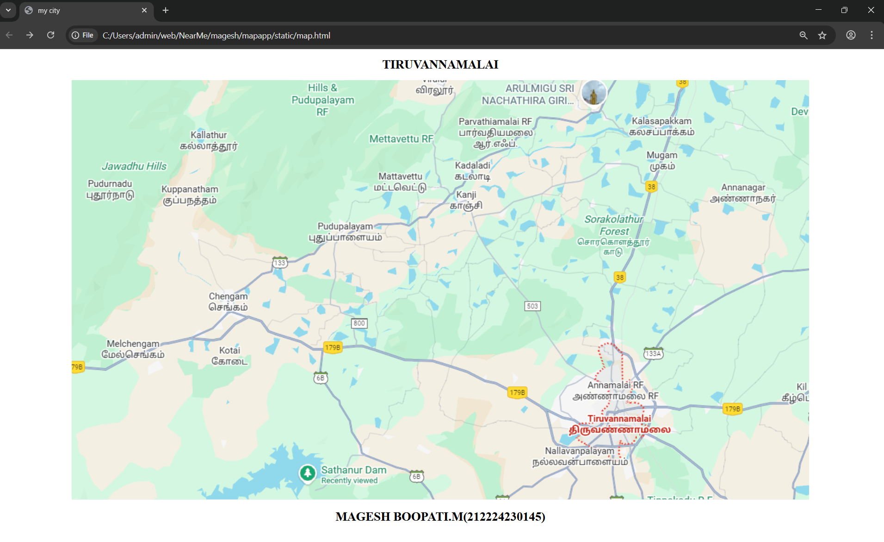
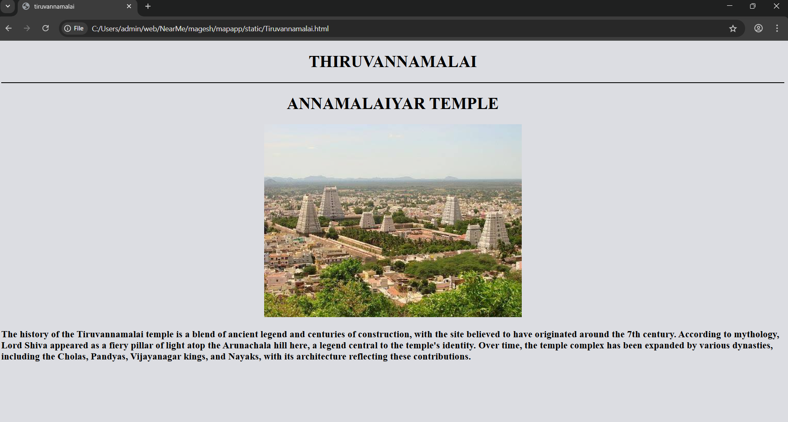
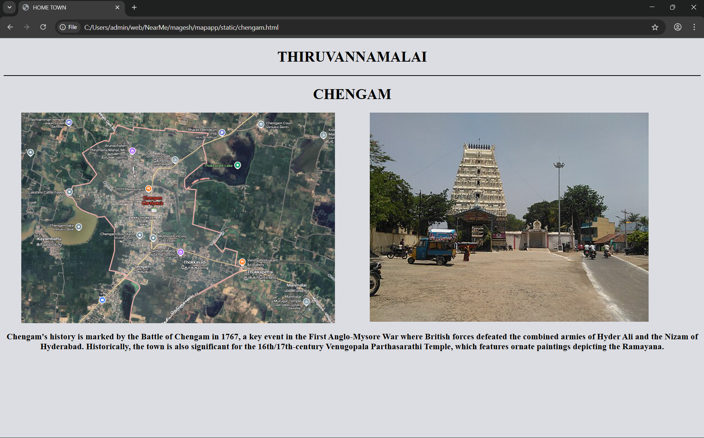
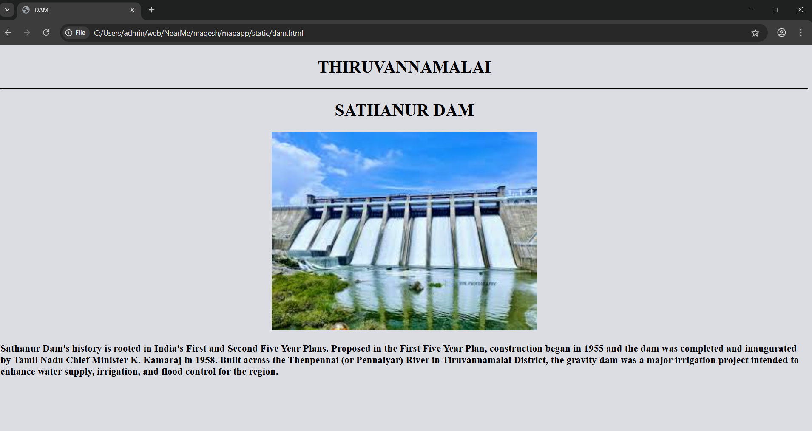
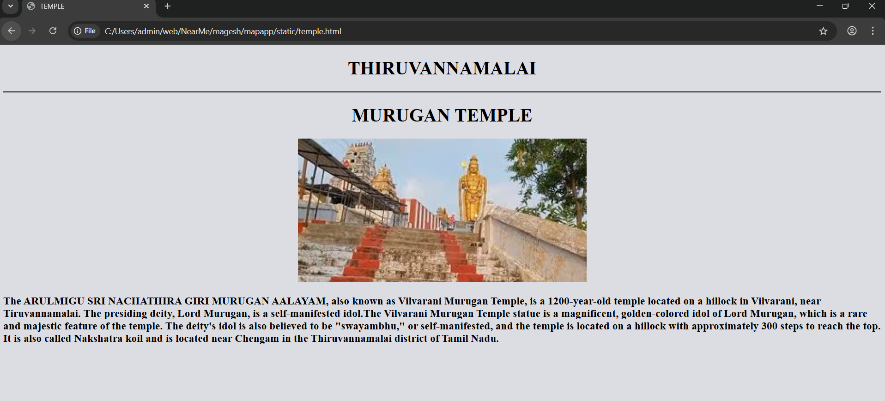
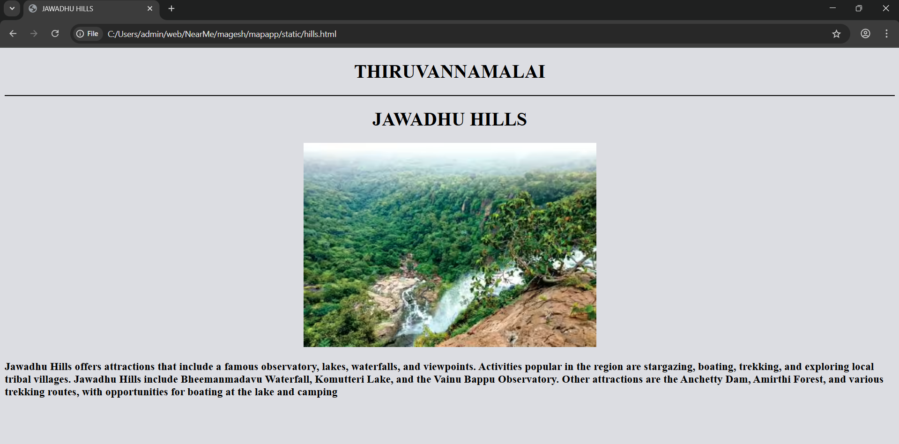

# Ex04 Places Around Me
## Date: 24/10/2025

## AIM
To develop a website to display details about the places around my house.

## DESIGN STEPS

### STEP 1
Create a Django admin interface.

### STEP 2
Download your city map from Google.

### STEP 3
Using ```<map>``` tag name the map.

### STEP 4
Create clickable regions in the image using ```<area>``` tag.

### STEP 5
Write HTML programs for all the regions identified.

### STEP 6
Execute the programs and publish them.

## CODE
## map.html
```python
<!-- Image Map Generated by http://www.image-map.net/ -->
 <!DOCTYPE html>
<html lang="en">
<head>
    <meta charset="UTF-8">
    <meta name="viewport" content="width=device-width, initial-scale=1.0">
    <title>my city</title>
    
</head>
<body>
    <h1 align="center">TIRUVANNAMALAI</h1>
    <center>
<!-- Image Map Generated by http://www.image-map.net/ -->


<map name="image-map">
    <area target="" alt="tiruvannamalai" title="tiruvannamalai" href="Tiruvannamalai.html" coords="1395,872,93" shape="circle">
    <area target="" alt="home town" title="home town" href="chengam.html" coords="410,580,89" shape="circle">
    <area target="" alt="dam" title="dam" href="dam.html" coords="594,1002,76" shape="circle">
    <area target="" alt="temple" title="temple" href="temple.html" coords="1352,44,56" shape="circle">
    <area target="" alt="hills" title="hills" href="hills.html" coords="115,255,108" shape="circle">
</map>
</center>
<center><h1><footer>MAGESH BOOPATI.M(212224230145)</footer></h1></center>
</body>
</map>
</html>
```
## tiruvannamalai.html
```python
<!DOCTYPE html>
<html lang="en">
<head>
    <meta charset="UTF-8">
    <meta name="viewport" content="width=device-width, initial-scale=1.0">
    <title>tiruvannamalai</title>
</head>
<body style="background-color: rgb(220, 221, 226);">
    <center><h1>THIRUVANNAMALAI</h1></center>
    <hr color="black">
    <center><h1>ANNAMALAIYAR TEMPLE</h1></center>
    <center></center>
    <h3>The history of the Tiruvannamalai temple is a blend of ancient legend and centuries of construction, with the site believed to have originated around the 7th century. According to mythology, Lord Shiva appeared as a fiery pillar of light atop the Arunachala hill here, a legend central to the temple's identity. Over time, the temple complex has been expanded by various dynasties, including the Cholas, Pandyas, Vijayanagar kings, and Nayaks, with its architecture reflecting these contributions.</h3>
</body>
</html>
```
## chengam.html
```python
<!DOCTYPE html>
<html lang="en">
<head>
    <meta charset="UTF-8">
    <meta name="viewport" content="width=device-width, initial-scale=1.0">
    <title>HOME TOWN</title>
   <style>
        .photo-wrapper {
            text-align: center;
        }
        .float-photo {
            float: left;
            margin: 0 2.5%; 
        }
        .clearfix::after {
            content: "";
            display: table;
            clear: both;
        }
        h1, hr {
            clear: both;
        }
        @media (max-width: 1050px) {
            .float-photo {
                width: 90%; 
                float: none;
                margin: 10px auto;
                display: block;
            }
        }
    </style>
</head>
<body style="background-color: rgb(220, 221, 226);">
    <center><h1>THIRUVANNAMALAI</h1></center>
    <hr color="black">
    <center><h1>CHENGAM</h1></center>

    <div class="photo-wrapper clearfix">
        
        
        
    </div>
    <center>
        <h3>
            Chengam's history is marked by the Battle of Chengam in 1767, a key event in the First Anglo-Mysore War where British forces defeated the combined armies of Hyder Ali and the Nizam of Hyderabad. Historically, the town is also significant for the 16th/17th-century Venugopala Parthasarathi Temple, which features ornate paintings depicting the Ramayana.
        </h3>
    </center>
</body>
</html>
```
## dam.html
```python
<!DOCTYPE html>
<html lang="en">
<head>
    <meta charset="UTF-8">
    <meta name="viewport" content="width=device-width, initial-scale=1.0">
    <title>DAM</title>
</head>
<body style="background-color: rgb(220, 221, 226);">
    <center><h1>THIRUVANNAMALAI</h1></center>
    <hr color="black">
    <center><h1>SATHANUR DAM</h1></center>
    <center></center>
    <h3>Sathanur Dam's history is rooted in India's First and Second Five Year Plans. Proposed in the First Five Year Plan, construction began in 1955 and the dam was completed and inaugurated by Tamil Nadu Chief Minister K. Kamaraj in 1958. Built across the Thenpennai (or Pennaiyar) River in Tiruvannamalai District, the gravity dam was a major irrigation project intended to enhance water supply, irrigation, and flood control for the region. </h3>
</body>
</html>
```
## temple.html
```python
<!DOCTYPE html>
<html lang="en">
<head>
    <meta charset="UTF-8">
    <meta name="viewport" content="width=device-width, initial-scale=1.0">
    <title>TEMPLE</title>
</head>
<body style="background-color: rgb(220, 221, 226);">
    <center><h1>THIRUVANNAMALAI</h1></center>
    <hr color="black">
    <center><h1>MURUGAN TEMPLE</h1></center>
    <center></center>
    <h3>The ARULMIGU SRI NACHATHIRA GIRI MURUGAN AALAYAM, also known as Vilvarani Murugan Temple, is a 1200-year-old temple located on a hillock in Vilvarani, near Tiruvannamalai. The presiding deity, Lord Murugan, is a self-manifested idol.The Vilvarani Murugan Temple statue is a magnificent, golden-colored idol of Lord Murugan, which is a rare and majestic feature of the temple. The deity's idol is also believed to be "swayambhu," or self-manifested, and the temple is located on a hillock with approximately 300 steps to reach the top. It is also called Nakshatra koil and is located near Chengam in the Thiruvannamalai district of Tamil Nadu. </h3>
</body>
</html>
```
## hills.html
```python
<!DOCTYPE html>
<html lang="en">
<head>
    <meta charset="UTF-8">
    <meta name="viewport" content="width=device-width, initial-scale=1.0">
    <title>JAWADHU HILLS</title>
</head>
<body style="background-color: rgb(220, 221, 226);">
    <center><h1>THIRUVANNAMALAI</h1></center>
    <hr color="black">
    <center><h1>JAWADHU HILLS</h1></center>
    <center></center>
    <h3>Jawadhu Hills offers attractions that include a famous observatory, lakes, waterfalls, and viewpoints. Activities popular in the region are stargazing, boating, trekking, and exploring local tribal villages.
        Jawadhu Hills include Bheemanmadavu Waterfall, Komutteri Lake, and the Vainu Bappu Observatory. Other attractions are the Anchetty Dam, Amirthi Forest, and various trekking routes, with opportunities for boating at the lake and camping
    </h3>
</body>
</html>
```

## OUTPUT
## map.png



## tiruvannamalai.png



## chengam.png



## dam.png



## temple.png



## hills.png



## RESULT
The program for implementing image maps using HTML is executed successfully.
